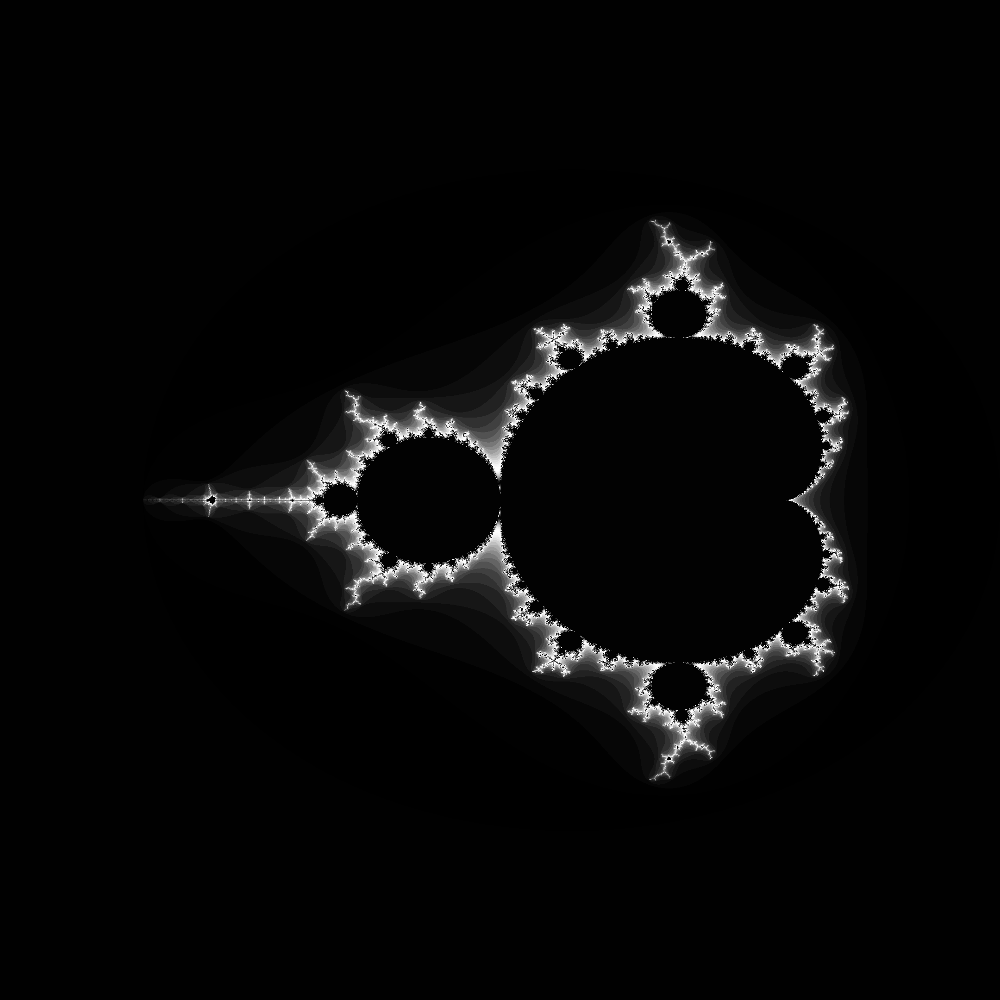
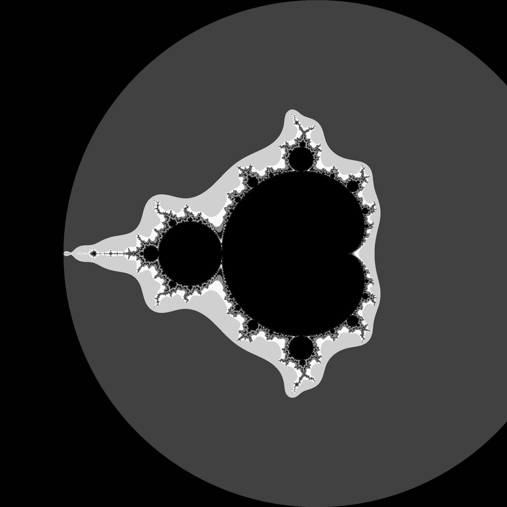

# Mandelbrot Set

A high-performance C++ project exploring different approaches for calculating and rendering the Mandelbrot set, from vectorized SIMD implementations to arbitrary-precision arithmetic.

## Features

  * **Generic Template Class:** Supports rendering and processing the Mandelbrot set with customizable viewports, resolutions, and iteration depths using any arithmetic type.
  * **Vectorized Implementation:** Utilizes **FMA** and **AVX-256** instructions for high-speed calculations (optimized for single-precision floats).
  * **Multithreading:** Built-in support for parallel execution using **OpenMP**.
  * **Deep Zoom Support:** Includes an executable leveraging the **Boost.Multiprecision** library to render viewports at extreme zoom levels.
  * **PPM Image Library:** A lightweight internal library for processing and saving images in the `.ppm` format.
  * **Custom Shaders:** Includes two stylized color schemes: **Indigo** and **Grey**.

## Prerequisites

Before building, ensure you have the following installed:

  * **GNU Multiprecision Library (GMP)**
  * **Boost Library** (specifically Multiprecision)
  * **OpenMP**
  * **Hardware Support:** The CPU must support **AVX256** and **FMA** instructions for the vectorized implementation.

## Installation

1.  **Clone the project:**

    ```bash
    git clone https://github.com/yourusername/Mandelbrot-set
    cd Mandelbrot-set
    ```

2.  **Build the project:**

    ```bash
    mkdir build && cd build
    cmake ..
    cmake --build .
    ```

## Examples

**Mandelbrot set rendered with the Grey shader:**

**Mandelbrot set rendered using the vectorized implementation:**

**Deep Zoom Example:**
Center: `(-1.295..., 0.440...)` | Viewport: Square with side `5.1E-55`.


## Performance

The following measurements represent the time taken to render a single **4K frame** on supported hardware:

| Implementation | Rendering Time (Seconds) |
| :--- | :--- |
| **Naive Implementation** | 0.752 s |
| **Vectorized (AVX/FMA)** | 0.087 s |
